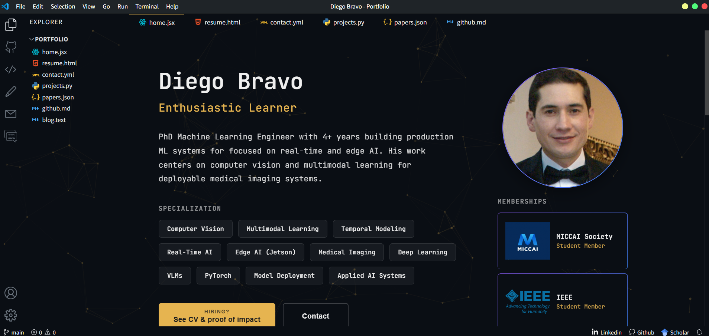

# Portfolio — Diego Bravo

Personal portfolio with a Visual Studio Code aesthetic, built with Next.js and deployed on Vercel.

**Live site:** [Diegobravoh.github.io](https://diegobravoh.github.io/)



## Stack

- **Framework:** Next.js 12 + React 17
- **Styles:** CSS Modules + CSS custom properties (5 themes)
- **Backend:** Notion API (contact form)
- **Deploy:** Vercel (primary) · GitHub Pages (secondary)

## Environment Variables

Copy `.env.local.example` to `.env.local` and fill in your values:

```bash
cp .env.local.example .env.local
```

| Variable | Description |
|---|---|
| `NOTION_API_TOKEN` | Notion integration token |
| `NOTION_DATABASE_ID` | Notion database ID for contact form |
| `GITHUB_API_KEY` | GitHub personal access token |
| `NEXT_PUBLIC_GITHUB_USERNAME` | Your GitHub username |

> `.env.local` is git-ignored and should never be committed. See `.env.local.example` for the expected format.

## Development

```bash
npm install
npm run dev       # localhost:3000
```

## Build & Deploy

```bash
npm run build     # next build + export → /out
npm run deploy    # publish /out to gh-pages branch
```

Vercel deploys automatically on push to `main`.

## Themes

Five themes available via the Settings page: `ayu`, `dracula`, `github-dark`, `night-owl`, `nord`. Selection persists in `localStorage`.

## Project Structure

```
pages/        # Routes + API endpoints
components/   # VS Code UI shell (Sidebar, Tabs, Explorer, etc.)
styles/       # CSS Modules per component + globals
public/       # Static assets (PDF CV, images, favicon)
```
